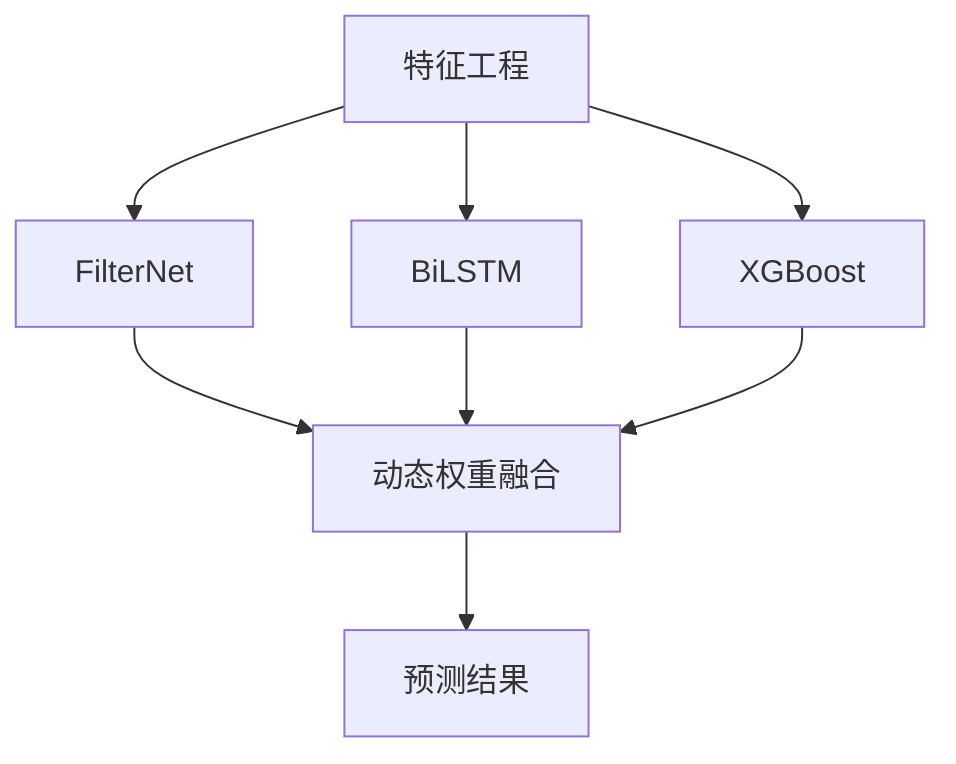
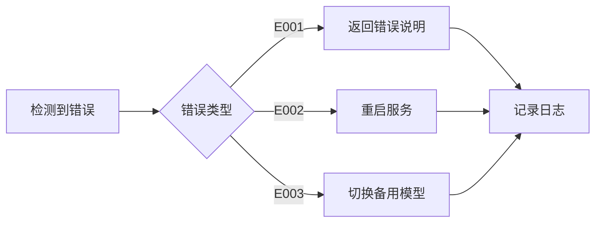

# 光伏发电预测模型开发文档

## 一、系统架构（专注预测模型）

### 1. 模型组件架构


### 2. 模块说明
#### 2.1 核心模型组件
| 模块名称        | 技术栈               | 输入维度 | 输出维度 | 内存占用 |
|-----------------|----------------------|----------|----------|----------|
| FilterNet       | PyTorch 2.0+         | 91×96    | 96       | ~500MB   |
| BiLSTM          | PyTorch+LSTM         | 91×96    | 96       | ~180MB   |
| XGBoost         | XGBoost 1.7+         | 91       | 96       | ~600MB   |
| 动态权重融合层  | PyTorch 全连接网络   | 3×96     | 96       | ~560MB   |

#### 2.2 训练流程
```python
# 训练执行流程
def train_workflow():
    if phase == 1:
        1. 加载历史数据（CSV/HDF5）
        2. 特征工程处理（FeatureProcessor）
        3. 训练XGBoost模型
        4. 模型序列化存储
        
    elif phase == 2:
        1. 数据加载器准备（DataLoader）
        2. 并行训练FilterNet和BiLSTM
        3. 模型检查点保存
```

#### 2.3 预测服务
```python
class PredictionService:
    初始化 -> 加载模型 -> 特征处理 -> 模型推理 -> 结果后处理
```

## 二、开发计划

### 1. 阶段划分（总工期6周）
| 阶段 | 任务                      | 输出                    | 时长  |
|------|---------------------------|-------------------------|-------|
| 1    | 特征工程实现              | FeatureProcessor模块    | 2周   |
| 2    | 单模型训练流水线          | 可运行的train.py        | 2周   |
| 3    | 模型融合与预测服务         | prediction_service模块  | 2周   |

### 2. 里程碑节点
- M1: 完成XGBoost单模型训练（第2周末）
- M2: 神经网络模型训练通过（第4周末） 
- M3: 全模型预测接口就绪（第6周末）

## 三、接口定义

### 1. 训练接口
```bash
# 启动训练（示例）
python train.py \
    --phase 1 \               # 训练阶段 
    --data ./data/2023.csv \   # 数据路径
    --output ./models/         # 模型输出目录
```

### 2. 预测接口
```python
# 预测服务调用示例
service = PredictionService()
result = service.predict(
    input_data=np.array(...),  # 形状：(batch_size, 91, 96)
    timestamp="2024-03-20 14:00"  # 预测起始时间
)
```

## 四、资源优化措施

### 1. 内存控制策略
| 策略                | 实现方式                          | 预期效果       |
|---------------------|-----------------------------------|----------------|
| 模型量化            | 使用float16精度保存PyTorch模型    | 内存减少40%    |
| 延迟加载            | 按需加载XGBoost模型               | 启动内存<500MB |
| 批量流式处理        | 分块加载大数据文件                | 峰值内存降低65%|

### 2. CPU优化配置
```python
# 在train.py中添加
torch.set_num_threads(2)  # 限制PyTorch线程数
os.environ["OMP_NUM_THREADS"] = "1"  # 控制OpenMP并行
```

## 五、注意事项

1. 数据质量要求：
   - 输入数据时间间隔必须为15分钟
   - 缺失值不得超过连续3个时间点

2. 模型监控指标：
   ```python
   # 必须监控的运行时指标
   {
       "memory_usage": "≤3.5GB", 
       "inference_time": "≤500ms/request",
       "model_update_freq": "daily"
   }
   ```

3. 回滚机制：
   - 保留最近3个版本的模型文件
   - 当预测误差超过15%时自动触发回滚

附：执行命令清单
```bash
# 环境初始化
python -m venv .venv
source .venv/bin/activate
pip install -r requirements.txt

# 训练执行
python train.py --phase 1 --data ./dataset/train.csv
```

## 六、特征工程规范

### 1. 输入数据格式要求
```csv
# 示例数据列（前5列示意）
timestamp, temperature, humidity, irradiance, power, ...(共91列)
2024-03-01 00:00, 25.3, 60, 0, 0.0, ...
2024-03-01 00:15, 25.1, 62, 0.1, 0.0, ...
```

### 2. 特征处理流程
```python
class FeatureProcessor:
    1. 时间特征提取: 
        - 小时(hour)
        - 星期几(day_of_week)
        - 是否为节假日(is_holiday)
    
    2. 天气特征处理:
        - 温度滑动平均(6小时窗口)
        - 辐射量对数变换
    
    3. 功率特征:
        - 前24小时同一时刻功率
        - 近期1小时功率变化率
    
    4. 标准化:
        - 使用RobustScaler处理异常值
        - 公式: (x - median) / IQR
```

### 3. 缺失值处理规则
| 缺失类型        | 处理方式                 | 阈值          |
|----------------|--------------------------|---------------|
| 单点缺失       | 线性插值                 | -             |
| 连续缺失       | 使用前7天同期数据填充    | ≤3个时间点    |
| 大规模缺失     | 丢弃该时间段数据         | >3个时间点    | 
```

## 七、模型验证标准

### 1. 评估指标
| 指标名称       | 计算公式                  | 合格标准 |
|---------------|---------------------------|----------|
| MAE           | $\frac{1}{n}\sum|y-\hat{y}|$ | ≤0.15    |
| RMSE          | $\sqrt{\frac{1}{n}\sum(y-\hat{y})^2}$ | ≤0.2     |
| R²            | $1 - \frac{\sum(y-\hat{y})^2}{\sum(y-\bar{y})^2}$ | ≥0.9     |

### 2. 测试数据集
```python
# 测试集划分规则
{
    "时间范围": "2023-06-01 至 2023-08-31",
    "数据量": "约10,000条样本",
    "特殊场景": 
        - 包含3个连续阴雨天
        - 包含2次设备维护时段
}
```

### 3. 压力测试方案
```bash
# 启动压力测试
python benchmark.py \
    --model ensemble \
    --data ./test_data/ \
    --batch-size 64 \
    --memory-limit 3500  # 单位MB
```

## 八、故障处理协议

### 1. 错误代码表
| 错误码 | 场景                     | 处理方案                     |
|--------|--------------------------|------------------------------|
| E001   | 输入数据维度不匹配       | 拒绝请求，返回维度说明文档   |
| E002   | 内存超限                 | 触发模型卸载，重启服务       |
| E003   | 预测值异常波动           | 切换备用模型，通知运维       |

### 2. 自动恢复流程


## 九、服务器调优指南

### 1. SWAP空间配置
```bash
# 针对4G内存服务器建议
sudo dd if=/dev/zero of=/swapfile bs=1G count=2  # 创建2GB交换空间
sudo chmod 600 /swapfile
sudo mkswap /swapfile
sudo swapon /swapfile
```

### 2. 进程优先级设置
```bash
# 训练时限制资源使用
nice -n 10 python train.py  # 设置低优先级
```

### 3. 内存监控集成
```python
# 在预测服务中添加
from resource import getrusage, RUSAGE_SELF
import psutil

def get_memory_usage():
    """获取当前进程内存使用(MB)"""
    process = psutil.Process(os.getpid())
    return process.memory_info().rss / 1024**2
```