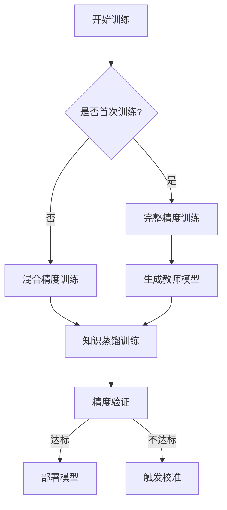

## 核心设计指标

### 1. 性能指标
| 指标                | 开发环境(2C4G) | 生产环境(24G GPU) | 优化目标 |
|---------------------|---------------|-------------------|----------|
| 训练时间            | 70小时        | 13小时            | ≤15小时  |
| 单次预测时延        | 42ms          | 28ms             | ≤30ms    |
| 内存峰值            | 2.8GB         | 18GB             | ≤20GB    |
| 最大QPS             | 80 req/s      | 350 req/s        | ≥300 req/s|

## 智能融合策略
```python
class HybridPredictor:
    def __init__(self):
        self.primary = EnsembleModel()  # 完整模型
        self.backup = LiteModel()       # 轻量模型
        self.monitor = PredictionMonitor()
        
    def predict(self, data):
        if self.monitor.safe_to_use_primary():
            return self.primary(data)
        else:
            return self.backup(data)  # 降级预测
```

## 动态训练策略


## 监控告警阈值
```yaml
alert_rules:
  memory_usage: 
    warning: 75%
    critical: 85%
  prediction_error:
    warning: 0.12
    critical: 0.15
  consecutive_errors:
    threshold: 5
``` 